# Auth0 Migration — Complete Flow Diagram

```mermaid
flowchart TD
    START(["🚀 node src/index.js\n[--fresh] [--verify]"])

    %% ════════════════════════════════════════════════════════════════
    %% FILE: index.js — Main Orchestrator
    %% ════════════════════════════════════════════════════════════════
    subgraph IDX["📄 index.js — Orchestration"]
        IDX_PRE["preflight()\nVerify Auth0 token + Redis source count"]
        IDX_FLUSH_S["flushManualReviewPending() — startup\nPop Redis pending buffer → Excel"]
        IDX_VFLAG{"--verify\nflag?"}
        IDX_VONLY["Verify-only mode\nno chunks, no Auth0 calls"]
        IDX_DETECT["detectAndRecoverGap()\nSkip if prior jobs still in queues\ngap = total − imported − manual"]
        IDX_ORPHAN["recoverOrphanedChunks()\nScan chunks/ dir for prior-run files\nLook up saved Auth0 job IDs"]
        IDX_ENQUEUE["importQueue.addBulk(newChunks)\nstatusQueue for orphans with Auth0 IDs"]
        IDX_WAIT["waitForCompletion() — 60s poll\nCheck all 3 queues + batchInFlight + staging"]
        IDX_ONCOMP["onComplete()\nFinal gap check → requeueGapUsers if gap\nflushManualReviewPending()\nsetMigrationStatus(completed)"]
        IDX_FLUSH_F["flushManualReviewPending() — final\nFlush remaining buffer → Excel"]
        IDX_DONE["gracefulShutdown()\n15s drain timeout per worker\nClose workers → queues → Redis"]
    end

    %% ════════════════════════════════════════════════════════════════
    %% FILE: redisDataService.js — Source Data + Chunking
    %% ════════════════════════════════════════════════════════════════
    subgraph RDSVC["📄 redisDataService.js — Source Data"]
        RD_STREAM["streamUsers()\nBatch LRANGE on migration:source:users\nSaves offset after each batch"]
        RD_MAP["mapSourceToAuth0(record)\nMap first_name/last_name/uid/email\nParse LDAP hash → custom_password_hash\nlanguage → user_metadata"]
        RD_CHUNK["createChunksFromRedis(chunksDir)\nStream users → ≤480KB JSON files\nUsername > maxLength → pending buffer\nbulkIndexUsersByEmail → Redis HASH"]
    end

    %% ════════════════════════════════════════════════════════════════
    %% FILE: checkpointService.js — Redis State
    %% ════════════════════════════════════════════════════════════════
    subgraph CKPT["📄 checkpointService.js — Redis State Store"]
        direction LR
        CK_SUC[("migration:success:users\nSET — email per imported user")]
        CK_MAN[("migration:manual:users\nSET — email per manual review user")]
        CK_PEND[("migration:manual-review:pending\nLIST — JSON buffer {user, reason}")]
        CK_STAGE[("migration:retry:staging\nLIST — users awaiting next batch")]
        CK_EIDX[("migration:source:email:index\nHASH — email → full user JSON\nPreserves custom_password_hash")]
        CK_SLOTS[("migration:active:auth0:jobs\nSET — active slot counter")]
        CK_INFLT[("migration:retry:batch:inflight\nCOUNTER — pop-to-queued gap guard")]
    end

    %% ════════════════════════════════════════════════════════════════
    %% FILE: queues/index.js — BullMQ Queue Definitions
    %% ════════════════════════════════════════════════════════════════
    subgraph BQSVG["📄 queues/index.js — BullMQ (Redis-backed)"]
        BQ_IMP[["importQueue — auth0-import\n5 attempts · 60s exp backoff\nconcurrency = MAX_CONCURRENT_JOBS"]]
        BQ_STAT[["statusQueue — auth0-status\n3 attempts · 10s exp backoff\nconcurrency = MAX × 2"]]
        BQ_RETRY[["retryQueue — auth0-retry-users\n1 attempt · concurrency 20"]]
    end

    %% ════════════════════════════════════════════════════════════════
    %% FILE: importProcessor.js — importWorker
    %% ════════════════════════════════════════════════════════════════
    subgraph IMPW["📄 importProcessor.js"]
        IW_SLOT["① Wait for Auth0 slot\ngetActiveAuth0JobCount() every 10s\nExtend BullMQ lock on each wait"]
        IW_POST["② auth0Service.createImportJob(chunkPath)\nPOST /api/v2/jobs/users-imports ≤480KB"]
        IW_TRACK["③ storeAuth0JobId(chunkId, jobId)\ntrackActiveAuth0Job(jobId) — +1 slot"]
        IW_POLL["④ statusQueue.add('poll-status', delay)\nSchedule first status check"]
    end

    %% ════════════════════════════════════════════════════════════════
    %% FILE: statusProcessor.js — statusWorker
    %% ════════════════════════════════════════════════════════════════
    subgraph STATW["📄 statusProcessor.js"]
        SW_FETCH["auth0Service.getJobStatus(auth0JobId)"]
        SW_RUN{"Auth0 job\nstill running?"}
        SW_REQUEUE["requeuePoll()\nRe-add with delay, new jobId per hop"]
        SW_DONE["releaseActiveAuth0Job() — −1 slot\nloadChunkUserMap(chunkId)"]
        SW_IDX["getIndexedUsersByEmails()\nBatch HMGET email index\n3-way fallback:\n1 chunk file → 2 email index → 3 error.user"]
        SW_ERRS["auth0Service.getJobErrors()\n⚠️ Auth0 strips custom_password_hash here"]
        SW_CLASS{"Classify\neach error"}
        SW_EXIST["isAlreadyExistsError()\nALREADY_EXISTS / DUPLICATED_USER\n→ recordSuccessfulUsers()\n→ pushToManualReviewPending (visibility)"]
        SW_DMR["isDirectManualReviewError()\nONE_OF_MISSING / NON_UNIQUE_PROPERTY_VALUE\n→ pushToManualReviewPending\nBypass retry queue entirely"]
        SW_RETRY["Recoverable error\n→ retryQueue.addBulk()\noriginalUser includes password hash"]
        SW_SUCC["recordChunkSuccesses()\nchunk users − failures → success SET"]
    end

    %% ════════════════════════════════════════════════════════════════
    %% FILE: retryProcessor.js — retryWorker
    %% ════════════════════════════════════════════════════════════════
    subgraph RETW["📄 retryProcessor.js"]
        RW_UNREC{"isUnrecoverableError?\nMAX_LENGTH · MISSING_REQUIRED\nONE_OF_MISSING · NON_UNIQUE\nDUPLICATED_USER · ALREADY_EXISTS"}
        RW_CNT["incrementUserRetryCount(email)\nmigration:retry:count:{email}"]
        RW_MAX{"retryCount >\nmaxUserRetries?"}
        RW_STAGE["pushToRetryStaging(user)\nRPUSH → migration:retry:staging"]
        RW_FULL{"stagingCount\n≥ 400?"}
        RW_FLUSH["flushRetryStagingBatch(false, job, token)"]
    end

    %% ════════════════════════════════════════════════════════════════
    %% FILE: retryBatchService.js — Batch Staging + Submission
    %% ════════════════════════════════════════════════════════════════
    subgraph BATW["📄 retryBatchService.js"]
        BW_POP["popRetryStagingBatch(400)\nLPOP up to 400 from staging"]
        BW_RACE{"< 20 users\nand not forceFlush?"}
        BW_BACK["pushBatchToRetryStaging()\nConcurrent flush race — push back"]
        BW_DEDUP["Deduplicate by email\nHandles restart duplicates"]
        BW_FLT["incrementBatchInFlight()\nBlocks premature completion signal"]
        BW_FILE["fs.writeFileSync\nretry-batch-{uuid}.json"]
        BW_SLOT["Wait for Auth0 slot\nExtend callerJob lock on each wait"]
        BW_POST["auth0Service.createImportJob(batchPath)"]
        BW_QPOLL["statusQueue.add('poll-status')\nLoops back through statusProcessor"]
        BW_DEC["decrementBatchInFlight()"]
    end

    %% ════════════════════════════════════════════════════════════════
    %% FILE: auth0Service.js — Auth0 Management API
    %% ════════════════════════════════════════════════════════════════
    subgraph A0SVC["📄 auth0Service.js — Auth0 Management API"]
        A0_TOK["_getToken()\nClient Credentials OAuth\nCached until expiry"]
        A0_CREATE["createImportJob(filePath, opts)\nPOST /api/v2/jobs/users-imports\nRetries 429 up to 8× via Retry-After header"]
        A0_STAT["getJobStatus(id)\nGET /api/v2/jobs/{id}\nReturns: pending / processing / completed / failed"]
        A0_ERRS["getJobErrors(id)\nGET /api/v2/jobs/{id}/errors\n⚠️ Security policy strips custom_password_hash"]
    end

    %% ════════════════════════════════════════════════════════════════
    %% FILE: failedUserService.js — manual-review.xlsx
    %% ════════════════════════════════════════════════════════════════
    subgraph XLSVC["📄 failedUserService.js — manual-review.xlsx"]
        XL_ENS["_ensureFile()\nCreate xlsx with styled headers if missing"]
        XL_LCK["proper-lockfile.lock()\nMulti-process write safety"]
        XL_RD["readFile() + re-apply column keys\nExcelJS loses keys when xlsx is serialised to disk"]
        XL_ROW["addRow() per user\nemail · username · names · failureReason · timestamp"]
        XL_SWP["Write to .tmp\nRetry unlinkSync up to 5× every 3s\nHandles EBUSY when Excel has file open\nrename .tmp → manual-review.xlsx"]
        XL_SET["recordManualReviewUsers(emails)\n→ migration:manual:users SET"]
    end

    %% ════════════════════════════════════════════════════════════════
    %% GAP RECOVERY FUNCTIONS — inside index.js
    %% ════════════════════════════════════════════════════════════════
    subgraph GAPREC["Gap Recovery — index.js (detectAndRecoverGap + requeueGapUsers)"]
        GR_COMP{"gap = totalUsers\n− importedCount − manualCount"}
        GR_SCAN["requeueGapUsers(totalUsers)\nLoad success + manual emails into memory Sets\nScan source list 500 users per batch\nmapSourceToAuth0() each user\nretryQueue.addBulk() — jobId: gap-{email} (idempotent)"]
    end

    %% ════════════════════════════════════════════════════════════════
    %% FLOW EDGES
    %% ════════════════════════════════════════════════════════════════

    %% ── Startup ──────────────────────────────────────────────────────
    START --> IDX_PRE
    IDX_PRE --> A0_TOK
    IDX_PRE --> IDX_FLUSH_S
    IDX_FLUSH_S -.->|"1 pop all"| CK_PEND
    IDX_FLUSH_S -->|"2 appendUsers per reason group"| XL_ENS
    XL_ENS --> XL_LCK --> XL_RD --> XL_ROW --> XL_SWP --> XL_SET --> CK_MAN

    IDX_FLUSH_S --> IDX_VFLAG

    %% ── Verify-only branch ───────────────────────────────────────────
    IDX_VFLAG -->|"--verify"| IDX_VONLY
    IDX_VONLY --> GR_COMP
    GR_COMP -->|"gap = 0"| IDX_DONE
    GR_COMP -->|"gap > 0"| GR_SCAN
    GR_SCAN --> BQ_RETRY

    %% ── Normal run: gap detection + orphan recovery ───────────────────
    IDX_VFLAG -->|"normal run"| IDX_DETECT
    IDX_DETECT --> GR_COMP
    GR_COMP -->|"gap = 0\nor prior queues not empty"| IDX_ORPHAN

    %% ── Chunk creation ───────────────────────────────────────────────
    IDX_ORPHAN --> RD_CHUNK
    RD_CHUNK -->|"stream source"| RD_STREAM
    RD_STREAM -->|"each record"| RD_MAP
    RD_MAP -->|"mapped user"| RD_CHUNK
    RD_CHUNK -->|"username too long"| CK_PEND
    RD_CHUNK -->|"bulkIndexUsersByEmail"| CK_EIDX
    RD_CHUNK -->|"chunk files created"| IDX_ENQUEUE

    %% ── Queuing ──────────────────────────────────────────────────────
    IDX_ENQUEUE --> BQ_IMP

    %% ── Import worker ────────────────────────────────────────────────
    BQ_IMP --> IW_SLOT
    IW_SLOT -->|"reads slot count"| CK_SLOTS
    IW_SLOT -->|"slot free"| IW_POST
    IW_POST --> A0_CREATE
    A0_CREATE -->|"auth0Job.id returned"| IW_TRACK
    IW_TRACK --> CK_SLOTS
    IW_TRACK --> IW_POLL
    IW_POLL --> BQ_STAT

    %% ── Status worker ────────────────────────────────────────────────
    BQ_STAT --> SW_FETCH
    SW_FETCH --> A0_STAT
    A0_STAT --> SW_RUN
    SW_RUN -->|"yes — re-poll"| SW_REQUEUE
    SW_REQUEUE --> BQ_STAT
    SW_RUN -->|"completed"| SW_DONE
    SW_DONE --> CK_SLOTS
    SW_DONE --> SW_IDX
    SW_IDX -->|"HMGET fallback"| CK_EIDX
    SW_IDX --> SW_ERRS
    SW_ERRS --> A0_ERRS
    A0_ERRS --> SW_CLASS

    SW_CLASS -->|"ALREADY_EXISTS\nDUPLICATED_USER"| SW_EXIST
    SW_EXIST --> CK_SUC
    SW_EXIST --> CK_PEND

    SW_CLASS -->|"ONE_OF_MISSING\nNON_UNIQUE_PROPERTY_VALUE"| SW_DMR
    SW_DMR --> CK_PEND

    SW_CLASS -->|"recoverable\nfailure"| SW_RETRY
    SW_RETRY --> BQ_RETRY

    SW_CLASS -->|"success users\nin chunk"| SW_SUCC
    SW_SUCC --> CK_SUC

    %% ── Retry worker ─────────────────────────────────────────────────
    BQ_RETRY --> RW_UNREC
    RW_UNREC -->|"yes — permanent failure"| CK_PEND
    RW_UNREC -->|"no"| RW_CNT
    RW_CNT --> RW_MAX
    RW_MAX -->|"yes — exhausted"| CK_PEND
    RW_MAX -->|"no"| RW_STAGE
    RW_STAGE --> CK_STAGE
    RW_STAGE --> RW_FULL
    RW_FULL -->|"yes"| RW_FLUSH

    %% ── Retry batch service ──────────────────────────────────────────
    RW_FLUSH --> BW_POP
    BW_POP --> BW_RACE
    BW_RACE -->|"yes — concurrent race lost"| BW_BACK
    BW_BACK --> CK_STAGE
    BW_RACE -->|"no — this worker owns batch"| BW_DEDUP
    BW_DEDUP --> BW_FLT --> CK_INFLT
    BW_FLT --> BW_FILE
    BW_FILE --> BW_SLOT
    BW_SLOT -->|"reads slot count"| CK_SLOTS
    BW_SLOT -->|"slot free"| BW_POST
    BW_POST --> A0_CREATE
    BW_POST --> BW_QPOLL
    BW_QPOLL --> BQ_STAT
    BW_QPOLL --> BW_DEC
    BW_DEC --> CK_INFLT

    %% ── Manual review buffer flush (triggered at startup + completion) ─
    CK_PEND -.->|"flushed at startup\nand completion"| IDX_FLUSH_S

    %% ── Completion ───────────────────────────────────────────────────
    IDX_ENQUEUE --> IDX_WAIT
    IDX_WAIT -->|"all 3 queues empty\nbatchInFlight = 0\nstaging = 0"| IDX_ONCOMP
    IDX_ONCOMP -->|"gap > 0 safety net\nrequeue + wait again"| GR_SCAN
    IDX_ONCOMP -->|"gap = 0"| IDX_FLUSH_F
    IDX_FLUSH_F -->|"appendUsers per reason group"| XL_ENS
    IDX_FLUSH_F --> IDX_DONE
```

---

## File Responsibilities Summary

| File | Role |
|---|---|
| `index.js` | Orchestration: startup, gap detection, orphan recovery, completion monitor |
| `redisDataService.js` | Source data streaming, user field mapping, LDAP hash parsing, chunk creation |
| `checkpointService.js` | All Redis state: slots, success/manual SETs, pending buffer, staging list, email index |
| `queues/index.js` | BullMQ queue + worker definitions (import, status, retry) |
| `importProcessor.js` | Slot-gated Auth0 upload, job tracking |
| `statusProcessor.js` | Auth0 job polling, error classification, original user lookup with password-hash fallback |
| `retryProcessor.js` | Per-user retry counting, unrecoverable detection, staging |
| `retryBatchService.js` | Atomic batch pop, dedup, upload, inflight tracking |
| `auth0Service.js` | Auth0 Management API calls with token caching and 429 retry |
| `failedUserService.js` | Excel writer with lockfile and EBUSY-safe atomic swap |

## Key Data Flow Notes

- **Password hash preservation**: Auth0 strips `custom_password_hash` from error responses. The `migration:source:email:index` Redis HASH preserves the full user object, and `statusProcessor` uses a 3-way fallback (chunk file → email index → error.user) to always retry with the real hash.
- **Manual review buffer**: Workers never write to Excel directly. They RPUSH `{user, reason}` to Redis. `flushManualReviewPending()` in `index.js` batches them to Excel at startup and completion, preventing crashes from blocking migration progress.
- **Slot gating**: Both `importProcessor` and `retryBatchService` share the same `migration:active:auth0:jobs` SET as a semaphore. `statusProcessor` releases the slot immediately when a job completes.
- **Completion safety**: `batchInFlight` counter guards the window between `popRetryStagingBatch` and `statusQueue.add`. `waitForCompletion` waits for both to be zero.
